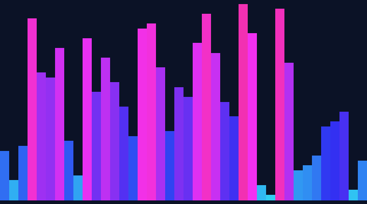

# sort-visualizer

[](https://edo1z.github.io/sort-visualizer/)
&nbsp;[](LICENSE)
&nbsp;[](#run-locally)

Learn sorting algorithms **by running them in your browser**. Watch 15 sorts race with
adjustable speed — or **write your own `sort()` and get it scored live**.

### ▶ [Open the live demo →](https://edo1z.github.io/sort-visualizer/)



## Two modes

### 👁 Watch
- 15 algorithms visualized: Timsort, Quicksort, Merge, Heap … down to Bogosort
- **Speed and array size** as live sliders (play / step / shuffle)
- Live comparison & swap counts, plus each algorithm's complexity, use cases, and pros/cons

### `</>` Code
- Implement `sort(a, viz)` yourself — your code animates exactly as written
- Load any algorithm's **reference implementation** from the dropdown (read it, tweak it, run it)
- Running it **scores your code** automatically:
  - **Correctness** — random + edge-case tests
  - **Operations** — comparison & swap counts
  - **Complexity estimate** — doubles the array size, measures how operations grow, and infers `O(n²)` / `O(n log n)` etc.
- Your code runs in a **Web Worker (isolated thread)** — it can't touch the page's DOM or cookies,
  and infinite loops are force-stopped automatically. A safe sandbox for running untrusted code.

The `viz` API: compare `viz.gt(i,j)` / `viz.lt(i,j)`, swap `viz.swap(i,j)`, write `viz.set(i,v)`,
read `viz.get(i)`. Only operations routed through `viz` animate the bars and count toward the score.

## Run locally
Just open `index.html` (no build, no dependencies — only the CodeMirror editor loads from a CDN).

> To guarantee the Worker-based sandbox, serve over HTTP:
> `python -m http.server` → `http://localhost:8000/`

## Layout
| File | Role |
|---|---|
| `index.html` | The app (UI + controls) |
| `web/sorts.js` | The 15 Watch-mode sorts (generators that `yield` intermediate states) |
| `web/meta.js` | Per-algorithm descriptions & complexity data |
| `web/templates.js` | The Code-mode reference `sort(a, viz)` implementations |
| `web/app.js` | Rendering, animation, controls, sandboxed runner |
| `web/verify.js` / `web/verify-templates.js` | `node` tests that every sort actually sorts |
| `sortviz/` + `generate.py` | (bonus) Python tool that renders the GIFs |

## Tests
```bash
node web/verify.js             # the 15 Watch-mode sorts
node web/verify-templates.js   # the 15 Code-mode reference templates
uv run pytest                  # the Python GIF implementations
```

## Notes
- Plain HTML/JS, no build step, no framework
- User code runs in a Blob-based Web Worker (falls back to a sandboxed iframe where Workers are blocked);
  a watchdog plus operation/frame caps stop runaway code
- An algorithm is "a generator that `yield`s states"; rendering is shared — adding a sort is a one-file change

## License
MIT — see [LICENSE](LICENSE).
